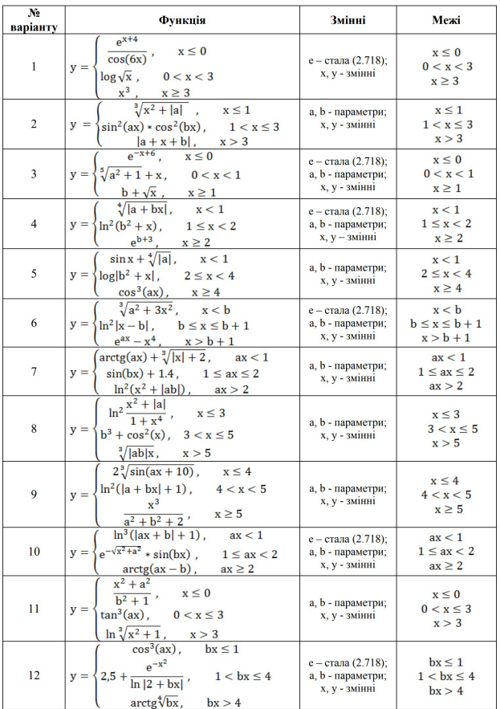
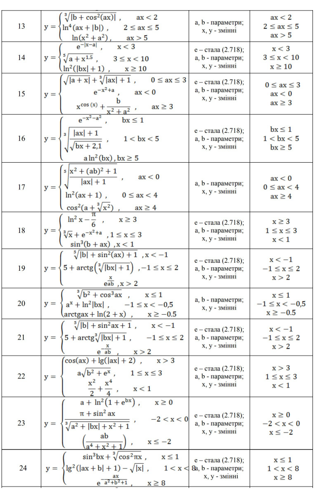
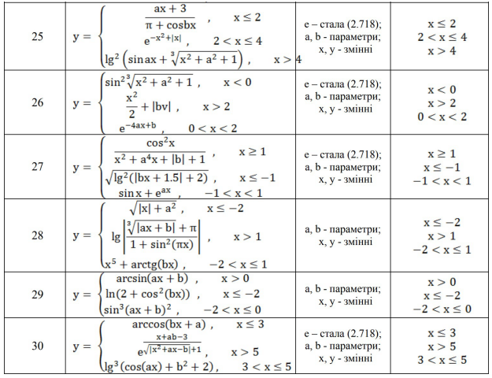

# Програмування розгалужених процесів
**Мета**: Створити, відлагодити та протестувати програму з розгалуженням для обчислення значення складної функції.

## Вказівки до роботи
Відповідно до цієї інструкції вам потрібно у середовищі Visual Studio Code з використанням набору компіляторів GCC для створити програми мовою C++ для розрахунку складної математичної функції.
1. Розробити блок-схему алгоритму програми.
2. Вибрати завдання згідно свого варіанту у ДОДАТКУ.
3. Реалізувати програму розрахунку складної математичної функції.

### Хід роботи:
1. підключіть бібліотеку math.h.
2. продумайте,   які   типи   змінних   вам   потрібно   використати   для   виконання завдання.
3. оголосіть   структуру,   в   якій   зберігатимуться   вхідні   дані   до   розрахунку (параметри, коефіцієнти, змінні) та результат виконання.
4. напишіть підпрограму-функцію, яка перевіряє умови (межі) вхідних змінних і повертає прапорець, що відповідатиме за ту математичну функцію, яку потрібно розрахувати.
5. напишіть   відповідні   підпрограми-функції   для   розрахунку   кожної математичної функції. Ці підпрограми повинні приймати вхідні параметри зі структури та повертати результат виконання.
6. реалізуйте оператор вибору  switch, який приймає прапорець - результат виконання функції із п.4 та викликає відповідну функцію із п.5. 
7. програма має вивести на консоль (термінал) вхідні дані до розрахунку та результат виконання.

### Оформлення звіту
У звіті навести
1. Свій варіант індивідуального завдання.
2. Блок-схема алгоритму програми.
3. Код (лістинг) програми.
4. Результати тестування для різних вхідних умов.
5. Конструктивний висновок — що ви дізналися нового, чого навчилися, якими способами та інструментами досягнули мети.

## ДОДАТОК

### Варіанти завдань

